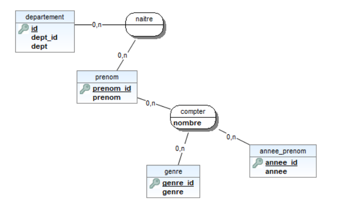

<h2 align="center" class="justify-items-center text-red-600"> Outil d'Aide à la Décision des Prénoms</h2>

## About OAD Prénoms

L'outil d'Aide à la décision des prénoms est un outil pour aider les futurs parents dans le choix des prénoms en leur montrant des statistiques sur les prénoms les plus donnés, les plus rare chez les filles et les garçons. Par ailleurs, étant une entreprise angevine, nous montrons également des statistiques sur les prénoms à Angers.

L'intervalle utilisé pour les prénoms est de 1900 à 2019.

## Pourquoi Laravel ?

J'ai choisi de faire l'OAD en Laravel puisque c'est un framework PHP permettant une utilisation inombrable de différents outils.

Toute fois, j'ai choisi Laravel car le projet est un outil web puisqu'il doit être facilement consultable par les utilisateurs mais aussi par choix personnel car le framework Laravel est une aide précieuse par rapport à si j'avais dû utiliser PHP seul.

## Installation
C'est un outil web donc il suffit d'avoir un serveur web pour le faire fonctionner.
Et un accès à la base de données.

## Utilisation
Pour lancer le projet, il suffit de démarre le serveur web intégré à PHP en faisant : <code>php artisan serve</code>

## Contributeurs

- **Bertille PINEAU**
- **ChatGPT**
- **Google Gemini** pour la première version de la base de données

## Accessibilité
Base de données sur le serveur de base de données sur la ferme du lycée : 192.168.124.4 (accessible que en ssh)
Accès à phpMyAdmin pour la visualisation de la base de données à l'adresse : 192.168.124.2 (bp-serv-fun)

Code git : https://github.com/Bertille1549/oad_prenoms.git

## oad_prenoms
### Aperçu de la base de données

## License

The Laravel framework is open-sourced software licensed under the [MIT license](https://opensource.org/licenses/MIT).
